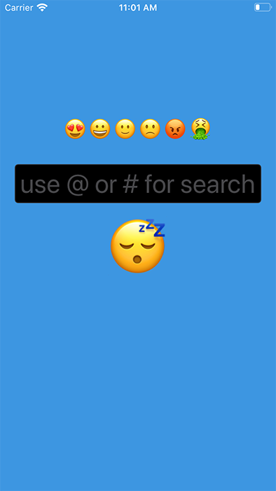
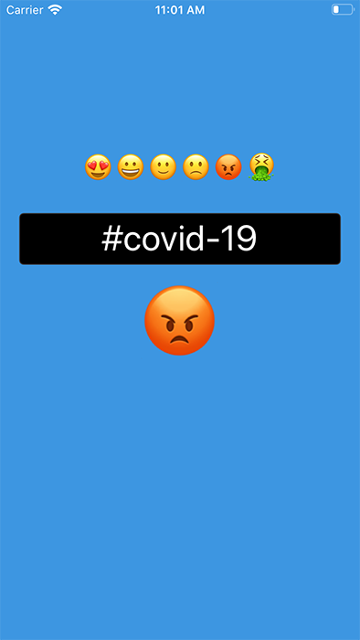
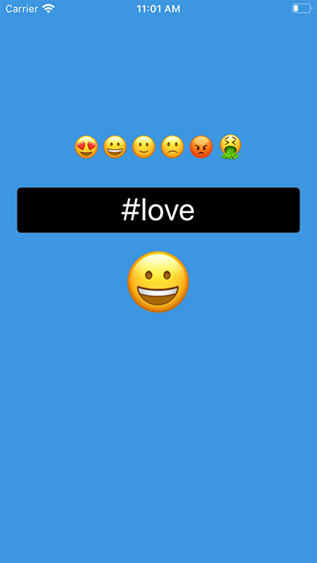

CoreML: Twitter sentiment analyzer 
===============

A study-course project that show how a trained machine learning model can detect the mood of a phrase.  

In this example we are searching for the mood of tweets category (#apple, @apple, #covid-19, #love, etc).

---

More details can be founded on this blog post:
**[https://www.albertopasca.it/whiletrue](https://www.albertopasca.it/whiletrue)**

Demo App
-----------

